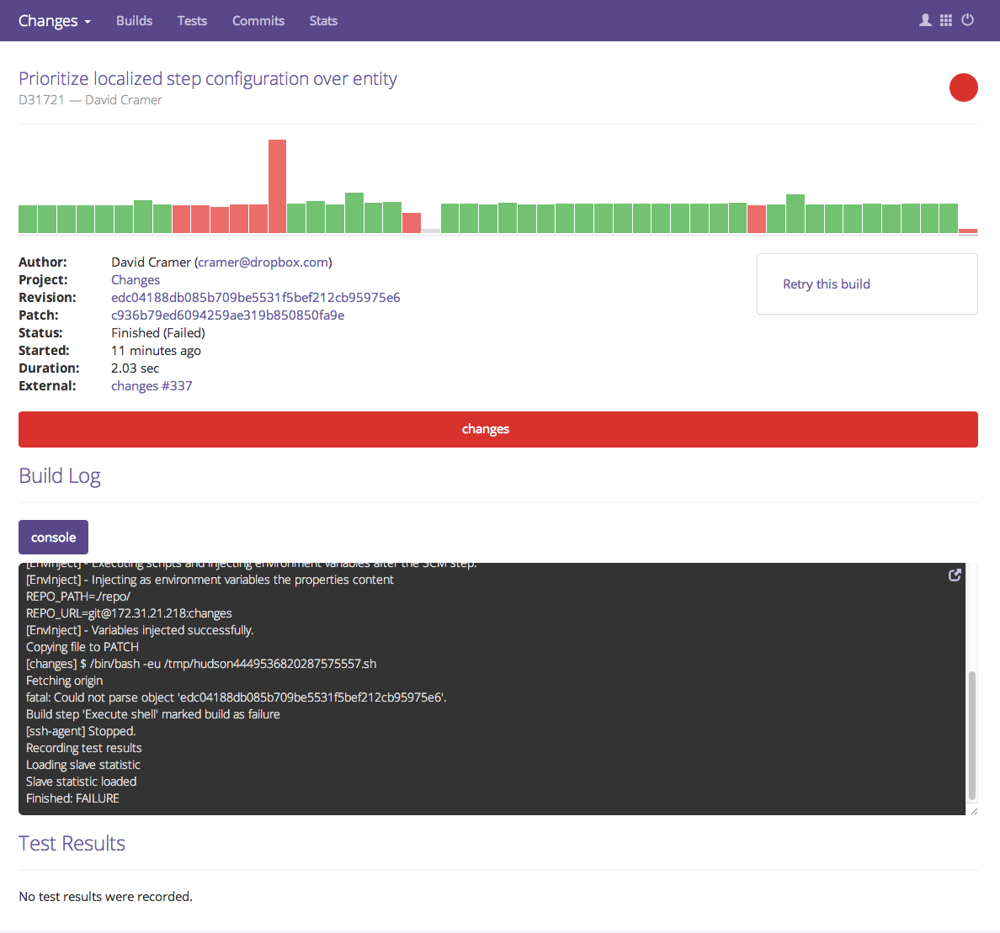
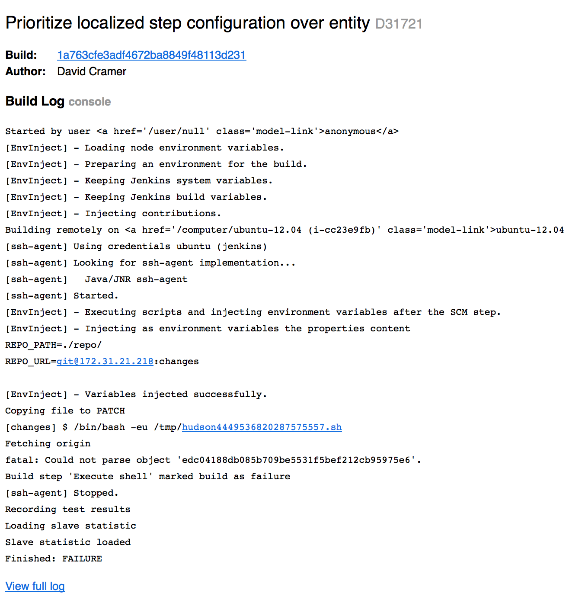

Using Changes
=============

At a high level, Changes is designed to be a view into the lifetime of a changeset. This is mostly apparant when you're viewing the results of automated tests.

A few concepts you should understand about Changes:

- A "Change" is a discrete object that represents a code changeset. This generally starts out as a patch, and works its way into a commit.
- Builds are bundled into families, and each build target has it's own build. That is if you're project needs to build on two platforms, there are two separate builds bundled into a single family grouping.

Understanding Build Results
---------------------------

To get the most out of Changes, the first thing you'll want to dive into are build results. These are presented in a variety of ways, but the most common forms of interaction will be via **email** and the **build details report**.

Data available depends on what the build was able to report. In some cases you may only be able to rely on the log output. In general, if things are working as intended, you'll be able to simply drill into an individual test result to see what's going on.

Let's start by taking a look at the minimal build report:

A few key things here:

- The phase that was executed (changes). There's only one in our example, but different systems may provide more details.
- The log streams available. In our example only a single console log was recorded.
- Test results. In this case we hit a critical failure, so no test results were reported.

So looking into how we'd understand this result, we're probably going to want to expand the build log. You can do this via the icon in the top right corner of the log stream. Once you're in here, it should be much easier to visually spot the failure, in our case it looks like we failed on checking out the revision:

.. image:: images/console-log.png
   :alt: Console Log

Now at the same time we also received an email as we were the author of this commit. The email contains a lot of similar information, but in a more limited fashion:

As you can see in this case, all we've got available is the build log, so it's up to us to scan through and identify the issue.
